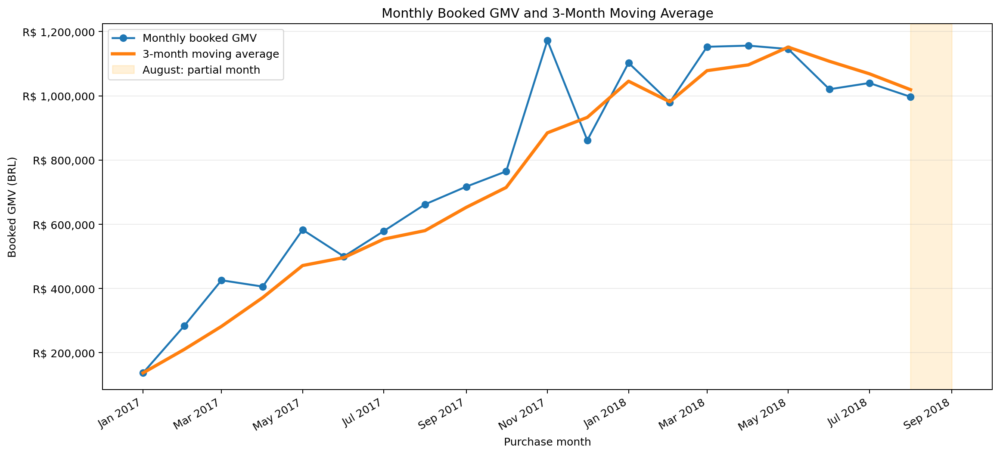
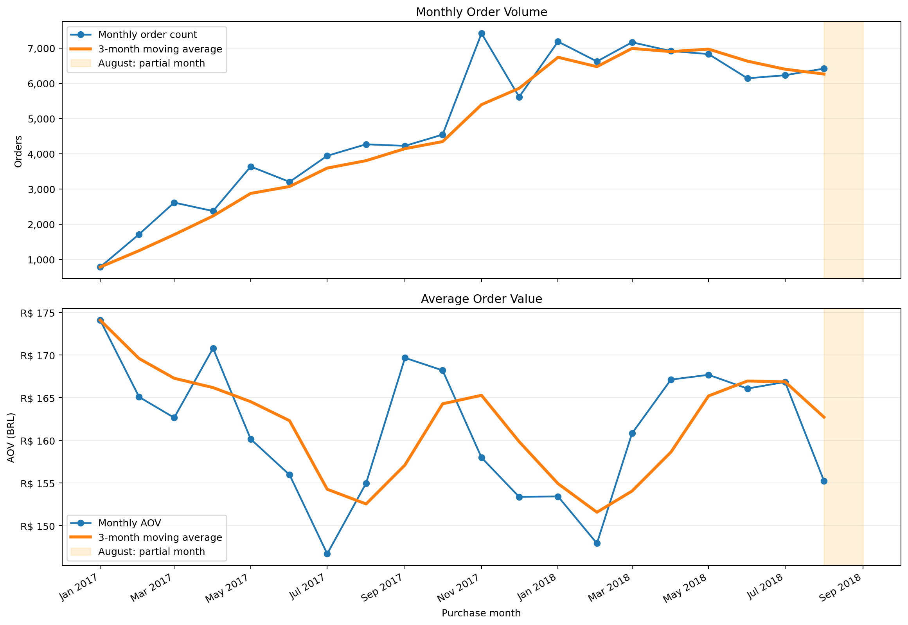
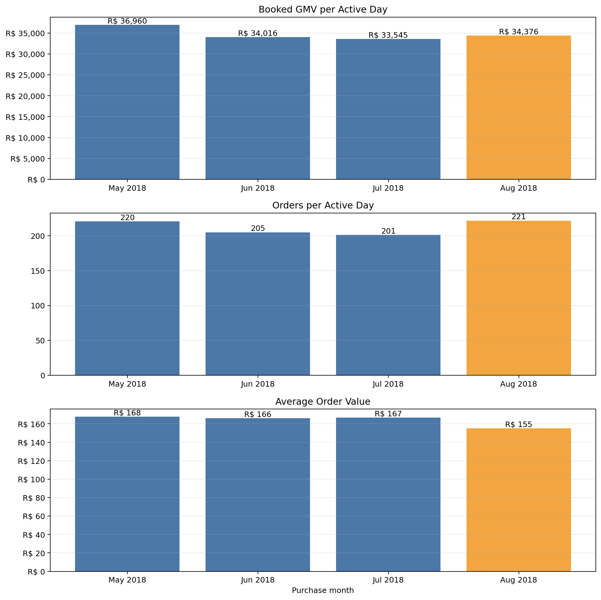
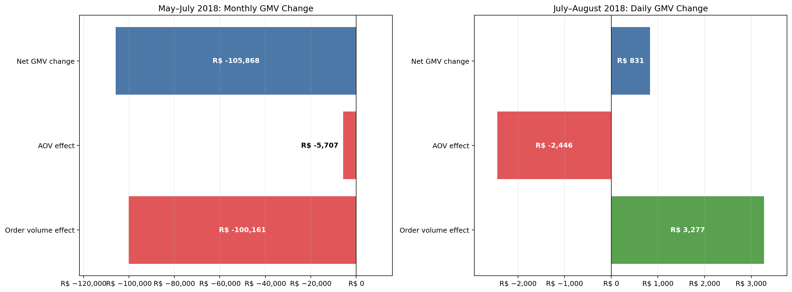
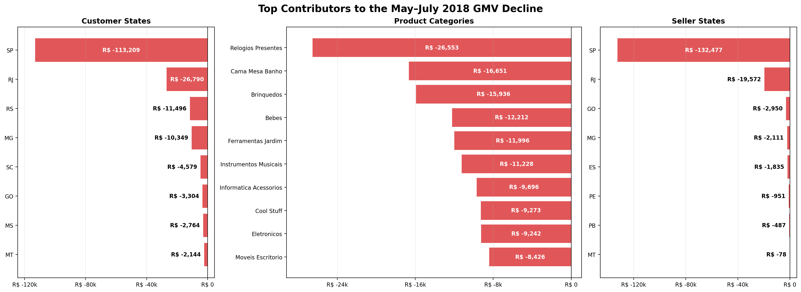

# Olist Sales Performance Investigation

A PySpark-based investigation of sales performance using the Brazilian Olist
e-commerce dataset.

The project answers the following business question:

> Sales revenue declined during the final months of the observation period. Why?

The analysis separates changes in order volume from changes in average order
value (AOV), then identifies the customer, product, and seller segments most
associated with the decline.

## Project Summary

- **Analysis period:** January 2017–August 2018
- **Valid orders:** 97,905
- **Order items:** 111,752
- **Total booked GMV:** R$15.69M
- **Primary tools:** PySpark, Spark SQL, Databricks, Delta Lake, pandas, Matplotlib

August 2018 contains only 29 active days. It is therefore evaluated separately
using daily normalized metrics instead of raw monthly totals.

## Key Findings

Between May and July 2018:

- Booked GMV decreased from **R$1.146M to R$1.040M**.
- Total GMV declined by approximately **R$105.9K (-9.24%)**.
- Order count decreased by **600 orders (-8.78%)**.
- Approximately **94.6%** of the GMV decline was associated with lower order
  volume.
- Approximately **5.4%** was associated with lower AOV.

The decline was concentrated in several overlapping segments:

- **SP customers:** approximately R$113.2K lower GMV
- **SP-based sellers:** approximately R$132.5K lower GMV
- **Leading declining categories:** watches and gifts, bed and bath products,
  toys, baby products, and garden tools

In August 2018:

- Daily GMV increased by approximately **2.48%**.
- Orders per active day increased from **201.06 to 221.41**.
- AOV decreased by approximately **6.94%**.

The main conclusion is that the May–July decline was primarily an
**order-volume problem**. Order activity began to recover in August, but lower
basket value became the new risk.

## Analytical Approach

### 1. Data validation and cleaning

Source tables were evaluated for:

- Duplicate business keys
- Missing and invalid values
- Referential integrity
- Payment and item-level consistency
- Impossible chronology and business-rule violations

### 2. Observation-level design

Two analytical tables were prepared:

- **order_sales:** one row per order
- **item_sales:** one row per order item

Payments and order items were aggregated before joining to prevent row
multiplication and GMV double counting.

### 3. GMV reconciliation

Order-level booked GMV was reconciled with item and freight totals. Booked GMV
was allocated to individual items so product and seller segments could be
analyzed without duplicating order payments.

The allocated item-level GMV reconciled with total order-level booked GMV.

### 4. KPI trend analysis

The monthly analysis includes:

- Booked GMV
- Order count
- Average order value
- Items per order
- Active days
- GMV per active day
- Orders per active day
- Three-month moving averages
- Month-over-month changes

### 5. GMV decomposition

The analysis uses the identity:

```text
GMV = Order count × Average order value
```

The symmetric midpoint method decomposes the change:

```text
Volume effect = Change in orders × Average AOV
AOV effect    = Change in AOV × Average order count
```

The two effects fully reconcile with the observed GMV change.

### 6. Segment contribution analysis

The May–July change is evaluated across:

- Customer state
- Product category
- Seller state

These dimensions are alternative views of the same GMV movement. Their
contributions overlap and must not be added together.

## Recommended Actions

1. Investigate traffic, conversion, and repeat purchasing in the SP customer
   market.
2. Review availability, pricing, and promotions in the largest declining
   product categories.
3. Examine active sellers, inventory availability, cancellations, and delivery
   performance among SP-based sellers.
4. Test product bundles, cross-sell offers, and free-shipping thresholds to
   support AOV.
5. Monitor daily GMV, orders per active day, and AOV separately.

## Visual Results

### Monthly Booked GMV



### Order Volume and Average Order Value



### Recent Daily KPIs



### GMV Change Decomposition



### Main Segment Contributors



## Repository Structure

```text
olist-sales-performance-investigation/
├── notebooks/        # Databricks notebooks and PySpark analysis
├── reports/
│   └── figures/      # Exported charts used in this README
├── .gitignore
├── README.md
└── requirements.txt
```

The notebooks follow the analytical workflow from source validation and sales
mart construction through KPI analysis, GMV decomposition, segment analysis,
and executive findings.

## Data Model

The project preserves the correct observation level throughout the analysis:

- Orders and aggregated payments: one row per order
- Order items: one row per order item
- Customer state analysis: order level
- Product and seller analysis: allocated item-level GMV

This design prevents many-to-many joins and GMV duplication.

## Installation

```bash
pip install -r requirements.txt
```

The analysis was developed in Databricks. PySpark is normally supplied by the
Databricks Runtime when the notebooks are executed there.

## Limitations

- August 2018 is a partial month with 29 active days.
- The segment analysis is descriptive and does not establish causality.
- Customer, product, and seller dimensions overlap.
- Traffic, campaign, pricing-history, and inventory data are unavailable.
- Additional operational data is required to determine the underlying cause of
  the SP order-volume decline.

## Author

**Eren Kılıçlı**

Computational Engineering Science graduate focused on Data Science, Data
Analytics, and AI Engineering.
